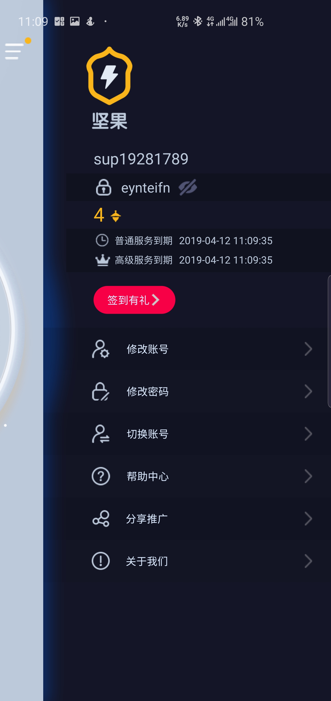
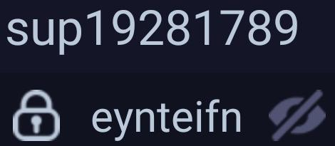

# Pick up Nuts 🌰

> Package nuts implements ImageRead, ImageWrite, ImageCrop and Baidu OCR API for image cropping and character recognition.


## ⚡ Features

- ✂️ Image Cropping (Refer to [mergi](github.com/noelyahan/mergi))
- 👀 Character Recognition


## 🚀 Getting Started

### Install via `go get`
```bash
go get github.com/cxfans/nuts@v0.1.0
```

### Usage

#### ✂️ Image Cropping
```go
err := CropImage("imgs/1.jpg", "crop/1.jpg",380, 640, 480, 240)
```
Image                    | Result Image
-----------------------------------|------------------------------------------
 | 

#### ✂️ 👀 Character Recognition
```go
client := NewClient(apiKey, secretKey, apiUrl)
if words, err := client.GetWordsFromImage("crop/1.jpg"); err == nil {
    fmt.Println(words)
}
```


Learn more [examples](examples).


### 🔵 License

This project is licensed under the MIT License - see the [LICENSE](LICENSE.md) file for details.